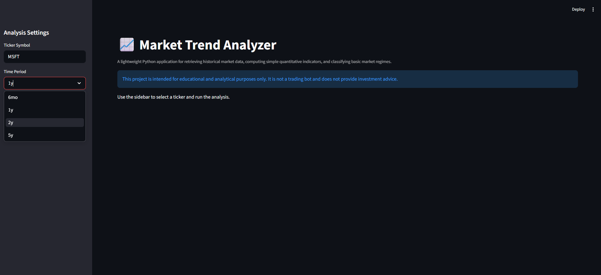
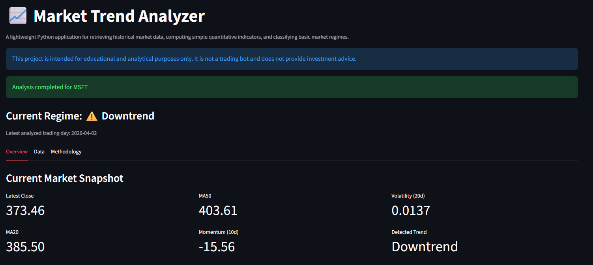
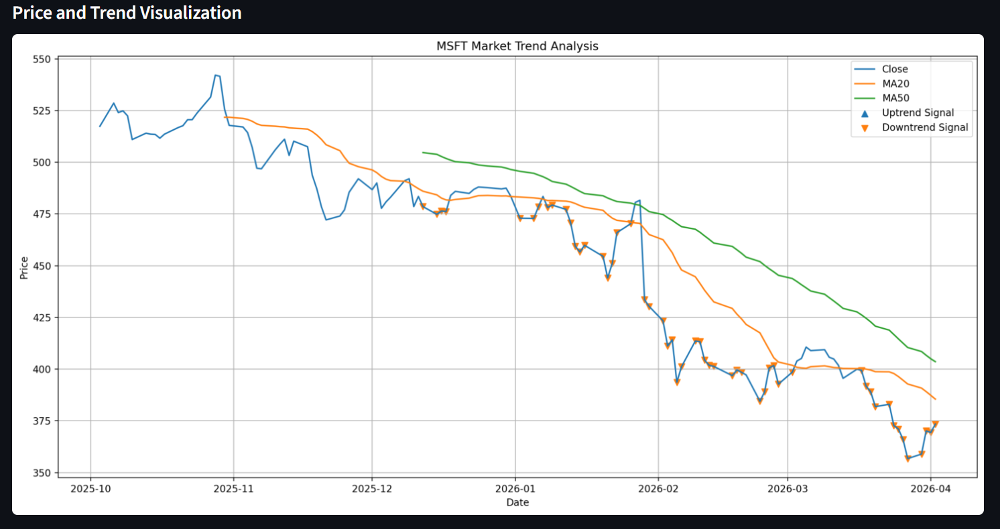
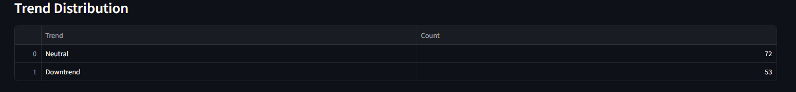

# 📈 Market Trend Analyzer

A lightweight Python application for analyzing financial market data using simple quantitative methods.
The tool retrieves historical price data via an API, computes key indicators, classifies market regimes, and presents results through an interactive Streamlit interface.

---

## 🚀 Project Motivation

This project was built to explore how basic quantitative indicators can be used to structure and analyze financial time series data in a clear and reproducible way.

The goal is **not** to develop a profitable trading system, but to demonstrate:

* data acquisition via APIs
* data preprocessing and transformation
* indicator engineering
* rule-based market classification
* interactive visualization and reporting

---

## ⚙️ Features

### 📊 Market Data Retrieval

* Fetches historical price data using `yfinance`

### 🧮 Indicator Calculation

* Moving Averages (MA20, MA50)
* Momentum (10-day)
* Daily Returns
* Rolling Volatility (20-day)

### 📉 Market Regime Classification

* Uptrend
* Downtrend
* Neutral

### 📈 Interactive Web Application

* Built with **Streamlit**
* User input for ticker and time period
* Real-time analysis execution
* Clear visualization of trends and indicators

### 📄 Analysis Output

* Market snapshot (latest values)
* Trend distribution
* Visual chart with signals
* Structured data view

---

## 🖥️ Streamlit Application

The project includes an interactive Streamlit-based interface for exploring market data and trend signals.

### Overview



### Market Snapshot & Metrics



### Price and Trend Visualization



### Data View



---

## 🧠 Methodology

The project applies simple quantitative rules to identify basic market regimes:

### Uptrend

* Price > MA20
* MA20 > MA50
* Positive momentum

### Downtrend

* Price < MA20
* MA20 < MA50
* Negative momentum

### Neutral

* All other cases

These rules are intentionally simple, interpretable, and reproducible.

---

## 📊 Example Output

The application generates:

* A chart showing price, moving averages, and trend signals
* A structured overview of current market conditions
* A dataset enriched with indicators and classifications

Example output files (CLI version):

```
output/
├── trend_chart.png
└── summary.txt
```

---

## ⚠️ Disclaimer

This project is for educational and demonstration purposes only.

* No transaction costs are considered
* No out-of-sample validation
* No risk management
* Not suitable for real trading decisions

The focus is on **data processing, analysis, and interpretability**, not financial performance.

---

## 🛠️ Tech Stack

* Python
* pandas
* numpy
* matplotlib
* yfinance
* **streamlit**

---

## ▶️ How to Run

### 1. Clone the repository

```bash
git clone https://github.com/janBaron/market-trend-analyzer.git
cd market-trend-analyzer
```

### 2. Install dependencies

```bash
pip install -r requirements.txt
```

### 3. Run the Streamlit app

```bash
streamlit run streamlit_app.py
```

---

## 📌 Project Structure

```
market-trend-analyzer/
│
├── app.py                  # CLI version
├── streamlit_app.py        # Web application
├── config.py
├── README.md
├── requirements.txt
│
├── data/
├── output/
│
└── src/
    ├── data_loader.py
    ├── indicators.py
    ├── trend_logic.py
    ├── plotting.py
    └── reporting.py
```

---

## 💡 Key Takeaways

This project demonstrates:

* structured handling of financial time series data
* implementation of basic quantitative indicators
* transformation of raw data into interpretable signals
* separation of logic and presentation (analysis vs. UI)
* basic productization via a lightweight web interface

---

## 👤 About Me

I am a Business Informatics student with a strong interest in data-driven systems, quantitative analysis, and software engineering.

This project reflects my approach to combining:

* technical implementation
* analytical thinking
* structured problem solving
* practical usability (via a simple web interface)

---

## 📬 Contact

Feel free to reach out or connect via GitHub.
